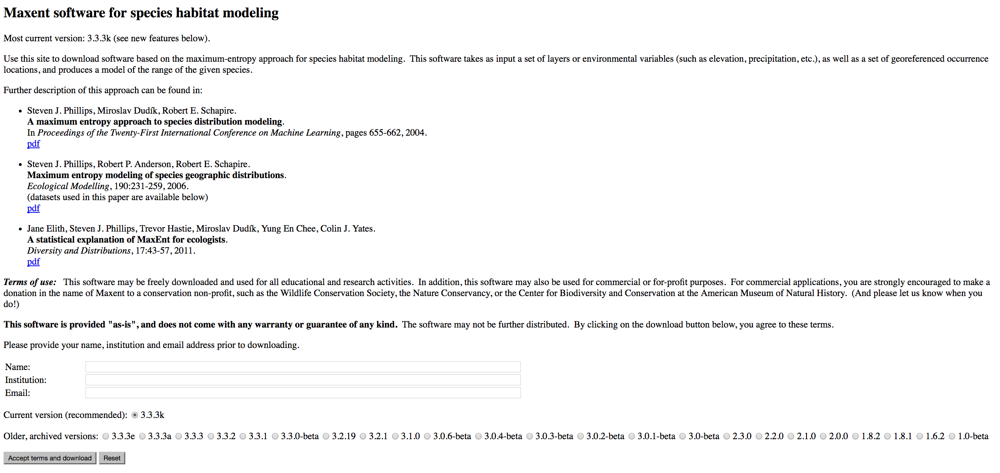
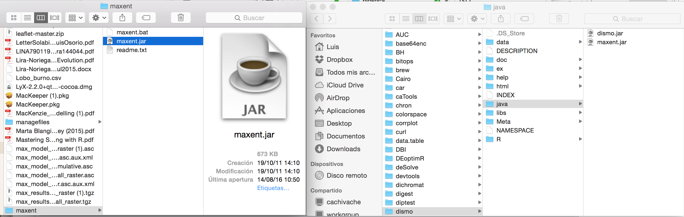

##### If you see this web page, it means that you dont have configured `maxent` for `dismo`. 

This is a short tutorial about how to install `maxent` on `dismo`. We need to follow this steps  

1) Make suere that you have `dismo` and `rJava` are installed
```{r}
paquetes <- c("dismo","rJava")
test <- paquetes[!paquetes %in% installed.packages()]
if(length(test)>0L)
  install.packages(test)
```

2) Go to `maxent` official website [click here](https://www.cs.princeton.edu/~schapire/maxent/). Fill the following form and download `maxent`.



3) Once dowloaded, copy the file **maxent.jar** into the following path

```{r}
paste(system.file(package="dismo"), "/java", sep='')
```




##### Now you are ready to use `maxent` within `nichetoolbox`
